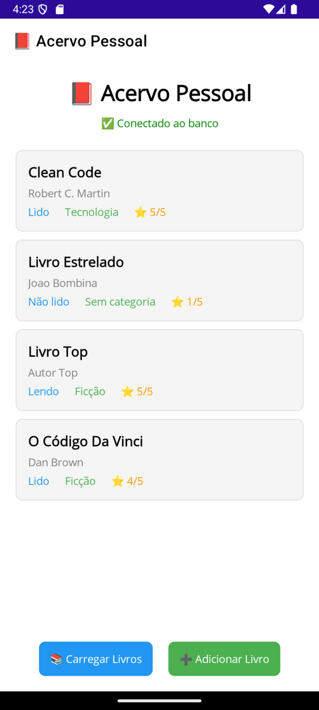
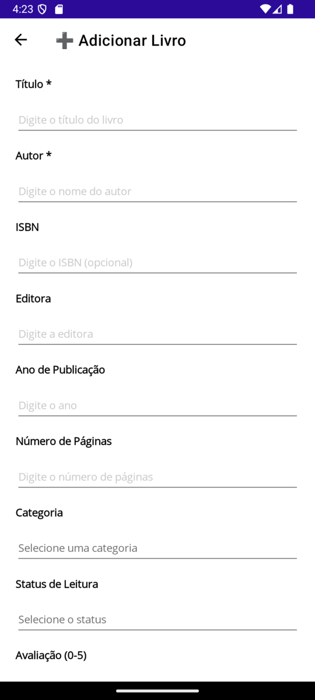
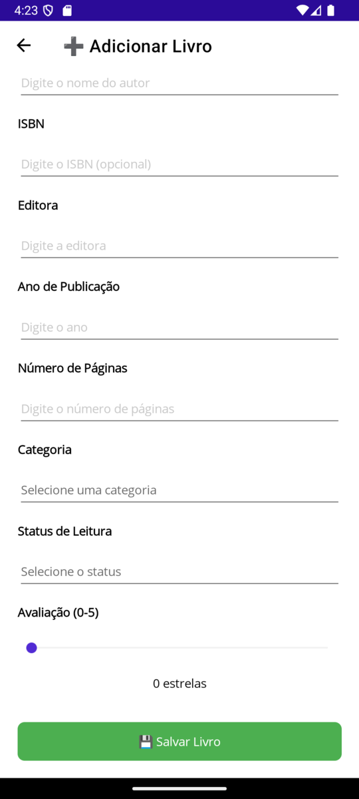

# Acervo Pessoal

O "Acervo Pessoal" é uma aplicação de desktop multiplataforma desenvolvida para ajudar os usuários a catalogar e gerenciar suas coleções de livros pessoais. Com ele, você pode adicionar, visualizar e organizar seus livros de forma simples e eficiente.

## ✨ Funcionalidades

  * **Listagem de Livros**: Visualize todos os livros do seu acervo com detalhes como título, autor, e categoria.
  * **Adicionar Novos Livros**: Cadastre novos livros na sua coleção, informando:
      * Título
      * Autor
      * ISBN
      * Editora
      * Ano de Publicação
      * Número de Páginas
      * Categoria
      * Status de Leitura (Ex: "Não lido", "Lendo", "Lido")
      * Avaliação (de 1 a 5 estrelas)
  * **Gestão de Categorias**: Organize seus livros por categorias.
  * **Conexão com Banco de Dados**: Seus dados são armazenados de forma segura em um banco de dados MySQL.

## 🛠️ Tecnologias Utilizadas

  * **.NET MAUI**: Um framework da Microsoft para a criação de aplicações multiplataforma nativas para iOS, Android, macOS e Windows a partir de uma única base de código em C\# e XAML.
  * **C\#**: A linguagem de programação principal utilizada no desenvolvimento do projeto.
  * **XAML**: Utilizada para a criação da interface de usuário da aplicação.
  * **MySQL**: Sistema de gerenciamento de banco de dados para o armazenamento dos dados do acervo.
  * **DotNetEnv**: Biblioteca para carregar variáveis de ambiente a partir de um arquivo `.env`, garantindo que as credenciais do banco de dados não fiquem expostas no código-fonte.

## ⚙️ Configuração do Ambiente

Para executar o projeto, é necessário configurar a conexão com o banco de dados.

1.  **Crie um arquivo `.env`** na raiz do projeto `AcervoPessoal`. Você pode copiar o arquivo `.env.sample` e renomeá-lo.

2.  **Preencha as variáveis de ambiente** no arquivo `.env` com as suas credenciais do banco de dados MySQL:

    ```bash
    DB_SERVER=seu_servidor_de_banco_de_dados
    DB_DATABASE=sua_base_de_dados
    DB_USER=seu_usuario
    DB_PASSWORD=sua_senha
    DB_PORT=sua_porta
    ```

A aplicação utiliza um `DatabaseService` para gerenciar a conexão e as operações com o banco de dados.

## 🚀 Como Executar o Projeto

1.  **Clone o repositório:**
    ```bash
    git clone https://github.com/silviojunior1401/AcervoPessoal.git
    ```
2.  **Abra o projeto** no Visual Studio.
3.  **Configure o arquivo `.env`** conforme as instruções da seção de configuração.
4.  **Selecione a plataforma desejada** (Windows, Android, etc.) e execute o projeto.

## 📱 Telas







## 🤝 Contribuições

Contribuições são bem-vindas\! Se você tiver sugestões de melhorias, novas funcionalidades ou correções de bugs, sinta-se à vontade para abrir uma *issue* ou enviar um *pull request*.

## 📄 Licença

Este projeto é distribuído sob a licença MIT. Consulte o arquivo `LICENSE` para mais detalhes.
